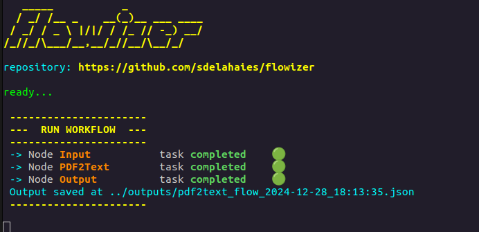
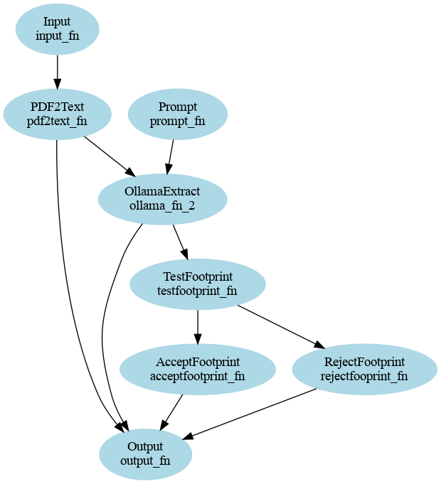

# Flowizer Workflow Engine

Flowizer is a lightweight and extensible workflow engine for creating, managing, and executing Directed Acyclic Graph (DAG)-based workflows. It provides a robust framework for defining workflows, managing node execution, and processing tasks with ease.

## Features

- **DAG-based workflow engine**: Supports complex workflows with dependencies between nodes.
- **Node tracking and execution**: Each node tracks its state and manages upstream and downstream dependencies.
- **Condition-based execution**: Allows conditional branching within workflows.
- **Real-time communication**: Uses a pub/sub mechanism for node communication.
- **API integration**: Provides an API for managing workflows, executing tasks, and generating visualizations.
- **Visualization support**: Generates DAG diagrams for workflow structures.

## Installation

### Prerequisites

- Python 3.8 or higher
- Virtual environment (optional but recommended)

### Steps

1. Clone the repository:
   ```bash
   git clone https://github.com/sdelahaies/flowizer.git
   cd flowizer
   ```

2. Set up a virtual environment (optional):
   ```bash
   python -m venv venv
   source venv/bin/activate  # On Windows: venv\Scripts\activate
   ```

3. Install dependencies:
   ```bash
   pip install -r requirements.txt
   ```

4. Start the API server:
   ```bash
   python api.py
   ```

   The API will be available at `http://0.0.0.0:8100`.

## Usage

### Define a Workflow

Workflows are defined using YAML configuration files. Each node specifies its type, upstream and downstream dependencies, and input/output parameters. Example `pdf2text_flow.yaml`:

```yaml
name: pdf2text_flow
createdAt: 27-12-24 14:23:00
nodes:
  - 1: Input,input_fn
  - 2: PDF2Text,pdf2text_fn
  - 3: Output,output_fn
flow: 
  - 1>>2
  - 2>>3
inputs:
  - Input: 
      filename: "latitude-9520-pcf-datasheet.pdf"
```

### Run a Workflow

Use the `/runflow` endpoint to execute a workflow. Upload your workflow configuration file to the `config` folder and provide its name:

```bash
curl -X 'POST' \
  'http://localhost:8100/runflow?config=pdf2text_flow.yaml' \
  -H 'accept: application/json' \
  -d ''
```


### Visualize a Workflow

Generate a DAG diagram of your workflow using the `/drawdag` endpoint:

```bash
curl -X 'POST' \
  'http://localhost:8100/drawdag?config=conditional_flow.yaml&CONFIG_FOLDER=..%2Fconfig&OUTPUT_FOLDER=..%2Foutputs&fmt=png' \
  -H 'accept: application/json' \
  -d ''
```



### Cleanup Temporary Files

Use the `/clean` endpoint to clear uploaded or output files:

```bash
curl -X 'DELETE' \
  'http://localhost:8100/clean?folder=outputs' \
  -H 'accept: application/json'
```

### API Endpoints

| Endpoint             | Method | Description                                    |
|----------------------|--------|------------------------------------------------|
| `/runflow`           | POST   | Execute a workflow with a specified config     |
| `/run_from_react`    | POST   | Execute workflow from a React frontend (not yet) |
| `/clean`             | DELETE | Clear files from the uploads or outputs folder|
| `/drawdag`           | POST   | Generate a DAG visualization of the workflow  |
| `/healthcheck`       | GET    | Check if the API service is operational       |

## Code Overview

### Core Components

#### `Node`
The `Node` class represents a workflow node, managing its state, execution, and communication with other nodes.

#### `Workflow`
The `Workflow` class orchestrates the execution of nodes, tracking their statuses and managing dependencies.

### API
The FastAPI-based server provides endpoints for executing workflows, managing files, and visualizing DAGs.

### Visualization
The `draw_dag` module creates visual representations of workflows in PNG format (or other specified formats).
